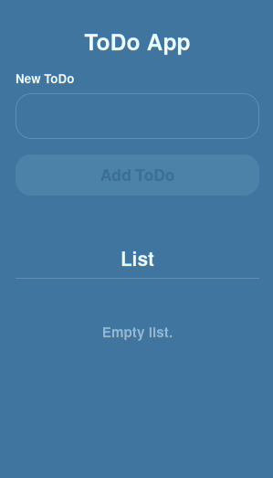
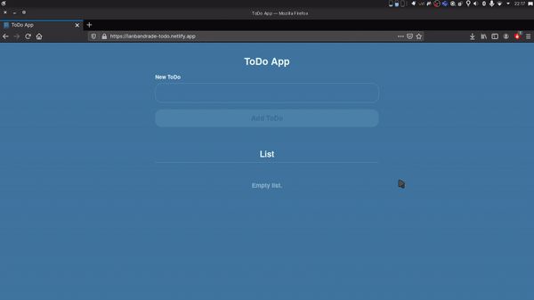

<div align="center">
  
</div>

<p align="center">
  <a href="#layout">Layout</a>
  &nbsp;&nbsp;&nbsp;|&nbsp;&nbsp;&nbsp;
  <a href="#about">About</a>
   &nbsp;&nbsp;&nbsp;|&nbsp;&nbsp;&nbsp;
  <a href="#techs">Techs</a>
  &nbsp;&nbsp;&nbsp;|&nbsp;&nbsp;&nbsp;
  <a href="#run">Run</a>
  &nbsp;&nbsp;&nbsp;|&nbsp;&nbsp;&nbsp;
  <a href="#license">License</a>
</p>

## Layout

<div align="center">


</div>

## About

Simple ToDo app.

## Techs

- Vue `3`

## Run

### Clone the repository

```bash
# Clone Repository
$ git clone https://github.com/ianbandrade/VUE_ToDo.git
```

### Setup

```bash
# Go to project folder
$ cd  VUE_ToDo

# Install Dependencies
$ yarn install

# Run Application
$ yarn serve
```

Access API at http://localhost:8080/

## License

This project is under the MIT license. See the file [LICENSE](LICENSE) for more details.

### <div align="center">Status

<div align="center">

<br/>

[](https://app.netlify.com/sites/ianbandrade-todo/deploys)

</div>
